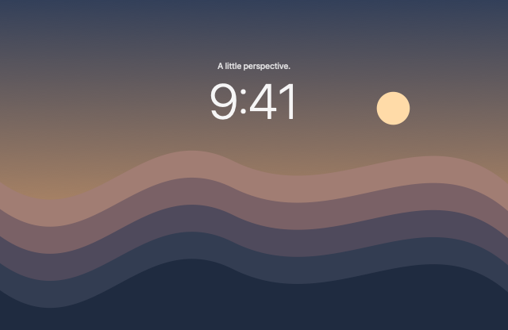
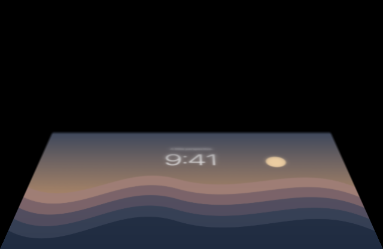

# Verification — 2026-09-12

## Completed on this Mac

| Check | Result |
| --- | --- |
| `swift test -Xswiftc -warnings-as-errors` | 8 tests passed, zero failures, zero compiler warnings |
| `./scripts/build-app.sh` | Release arm64 application built; Info.plist valid |
| `codesign --verify --deep --strict dist/BendMe.app` | Passed (local ad-hoc signature) |
| Bundled executable `--diagnose` | Apple M3 Pro; built-in display present; real sensor readings from 107° to 116° observed during session |
| Bundled executable `--self-test dist/verification` | 15 real Metal/MPS renders passed; all styles at 135°, 90°, 60°, 25°, 5° |
| Open-lid GPU identity | Mean byte error 0.000 for all three styles |
| Folded GPU geometry | Black outside projected desktop; nonempty, narrowed desktop at 25° |
| Native settings UI | Inspected using native app automation (no browser); all Appearance controls fit without scrolling |
| Manual preview | Accessibility Decrement changed angle 65° → 52° → 39° → 26°; image visibly folded |
| Style selection | Frost and Shade selections changed UI and rendering; restored user's Shade choice |
| Follow lid | Preview read real 110° sensor angle and disabled manual slider |
| Settings persistence | Shade remained selected after app restart |
| Permission failure | General reports missing Screen Recording; capture smoke test exits with an explicit permission error and never requests access |

[GPU report](verification-gpu.json) contains the numeric render checks.

| Open | Folded (Frost, 25°) |
| --- | --- |
|  |  |

These are the app's original procedural artwork rendered with the actual GPU pipeline. They are not captured desktop frames.

## Activation follow-up — verified

The user requested enabling the app. System Settings showed BendMe permission enabled, but the current ad-hoc build still reported denied. Toggling and restarting did not repair it. Resetting only BendMe's ScreenCapture entry and re-adding the exact current app bundle in System Settings did. The native UI now shows **LIVE**, **Pause BendMe**, and **Follow lid: on**. Shade and the 100° clear angle were preserved. Observed lid: 112°.

A LaunchServices smoke test returned:

```text
PASS: 3 complete live frames at 1512×982; overlay exclusion resolved; capture stopped. No desktop frames saved.
```

The test stream stopped; the main app remained LIVE. This confirms real desktop capture and successful exclusion lookup for the overlay window. No desktop frames were persisted. No app rebuild was performed during the permission repair.

Reproduce in the GUI app's authorization context:

```sh
open -n -g -W --stdout /tmp/bendme-capture.out --stderr /tmp/bendme-capture.err dist/BendMe.app --args --capture-test
cat /tmp/bendme-capture.out /tmp/bendme-capture.err
```

Direct execution from the automation terminal still reported permission denied, while the GUI and LaunchServices-launched test succeeded. This is a macOS launch-responsibility distinction; the direct CLI result is not evidence that the active GUI app cannot capture.

Physical lid-to-desktop alignment, visual recursion under an actively folded overlay, full-screen Spaces, global pause during a visible effect, and sleep/wake recovery remain **unverified** end to end. Gently lower the lid below 100° to exercise the live fold. The effect intentionally clears above that angle.

## Delivery boundaries

The application is a local arm64 build for this Mac, not a notarized public release. It has no remote repository or available GitHub MCP, so no GitHub issue was created or closed and no commit was pushed. Local planning and commit preserve the implementation for follow-up.

## Public release preparation (2026-09-12)

Eight Swift tests with warnings as errors passed after supporting Xcode's app target. The isolated public arm64 preview passed 15 Metal renders across all three styles with exact open-lid identity. Strict code-signature verification passed (ad-hoc signing, not notarization). The unsigned Xcode archive succeeded; a sandboxed copy read the physical lid sensor on Apple M3 Pro. Final signed sandbox capture and broader physical acceptance remain pending.

Website: lint, three Node tests, strict TypeScript, client/server build and HTML prerender passed. Local HTTP returned 200. Built anchors and static asset paths resolve. npm audit reported zero advisories. No browser visual, responsive or accessibility session was performed because the user prohibited browser tools.

Release commands: `./scripts/package-preview.sh`; `./scripts/archive-app-store.sh --unsigned`; `cd website && npm ci && npm run check`. See distribution/SETUP.md for remaining store gates. Existing authorized dist/BendMe.app was preserved.

Public verification: Pages run 34662530449 and Checks run 34662530463 succeeded. The live page and all six initial HTML assets returned HTTP 200. The public v0.1.0 desktop ZIP matched the local build byte for byte and passed ZIP integrity testing. SHA-256: `873619610df1bf05a5a83e7a343110b5d0de04f25a4d9225166ff3899db97076`.

## DMG packaging

`./scripts/package-dmg.sh` produces a compressed disk image from the existing release app. Verified read-only mount, strict embedded app signature, Applications symlink, installation notes, and identical app contents against the v0.1.0 ZIP. Disk ejected cleanly. Website checks passed after switching the primary download to DMG. Packaging does not change ad-hoc signing or notarization status.

Public DMG and its checksum were downloaded from GitHub Releases and matched local artifacts byte for byte. The downloaded disk image passed `hdiutil verify`. Live Pages HTML contains the versioned DMG URL and installation instructions.

## Developer ID submission

Paid Xcode team verified. Automatic archive and Developer ID upload succeeded through the existing account session. Submitted app has hardened runtime and secure timestamp; all 15 GPU self-test renders passed on Apple M3 Pro. Invalid script commands fail, and notarized-mode packaging rejects the old ad-hoc app. Upload success is not Apple acceptance; approval/export and Gatekeeper checks are pending.

Apple accepted the direct-distribution app. Xcode exported the approved app; strict signature, stapled ticket, Gatekeeper assessment and mounted DMG checks passed. Public release downloads were checked against local SHA-256 hashes before deployment.

## Fresh-install preparation

Removed the installed public app and the original local development app, stopped both running instances, and ejected three installer volumes. Reset privacy grants for the public/development/diagnostic identifiers and cleared defaults. Process, app-path and mounted-volume checks confirmed none remain. Source and release artifacts are preserved. This supersedes earlier notes that dist/BendMe.app is running or authorized; the next installation must receive a fresh Screen Recording grant.

Two separate sandboxcheck container directories retain only macOS-protected metadata; both Data directories were removed. Direct metadata removal was denied and Finder deletion timed out. These are not the public app container and hold no remaining BendMe preferences. Full removal of those metadata remnants remains open under issue #5.

## Dock application, v0.1.1

Both packaging paths use LSUIElement=false and normal execution uses regular activation. Runtime checks of the local build and installed signed app reported regular activation, one visible settings window and hidden=false. The first probe was too early in launch and was repeated after startup. Existing-app reopening kept the window visible; minimized restoration is implemented but was not separately exercised through native UI automation. Eight Swift tests and website checks passed. Apple accepted v0.1.1; ticket, signature, Gatekeeper, mounted DMG and installed-bundle checks passed. The approved app replaced the installed BendMe-2.app without resetting preferences or permissions.

Public v0.1.1 DMG, ZIP and checksum manifest matched local hashes. Pages run 34667657164 succeeded; live HTML contains the new versioned DMG and Dock feature copy.
GitHub Checks run 34667657103 passed for the 0.1.1 implementation, including native tests/archive and website checks.

## Guided setup 0.1.2/build 3 — Issue #7

- `swift test -Xswiftc -warnings-as-errors`: 17 tests passed. Setup state transitions, permission revocation, renamed installations, fresh metadata and build matching are covered.
- `./scripts/render-setup-checks.sh`: eight actual SwiftUI layouts rendered and visually reviewed: install, permission, first effect, unsupported hardware, ready, waiting/granted companion, and capture error. These use synthetic state and app-owned bitmap rendering; no desktop frames or OS consent controls were captured.
- Website `npm run check` passed. Native managed archive and upload succeeded; Apple accepted version 0.1.2. Stapled ticket, strict signature and Gatekeeper assessment passed.
- Mounted DMG validated the approved app, Applications shortcut and guide-first notes. Installed the approved public bundle over the isolated local setup-preview build, preserving public defaults and permissions. Runtime reports regular Dock activation, one visible settings window, and hidden=false.
- Actual macOS consent switches and a complete physical-lid walkthrough were not automated. macOS retains control of consent; the companion is a labeled visual example, not an overlay attached to OS controls.
- Public v0.1.2 DMG, ZIP and checksum files match local SHA-256 hashes. GitHub Pages deployment 34669038165 passed; live HTML contains the new DMG link and interactive Setup guidance.
- GitHub Checks run 34669038183 passed: native tests, unsigned App Store archive, website checks and dependency audit. Issue #7 is complete.
